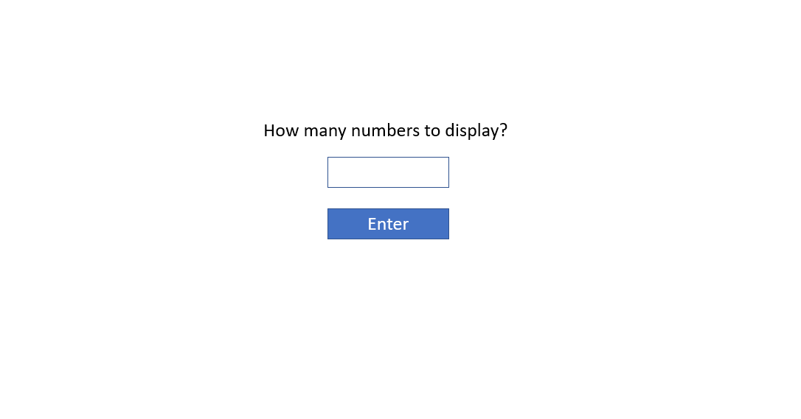
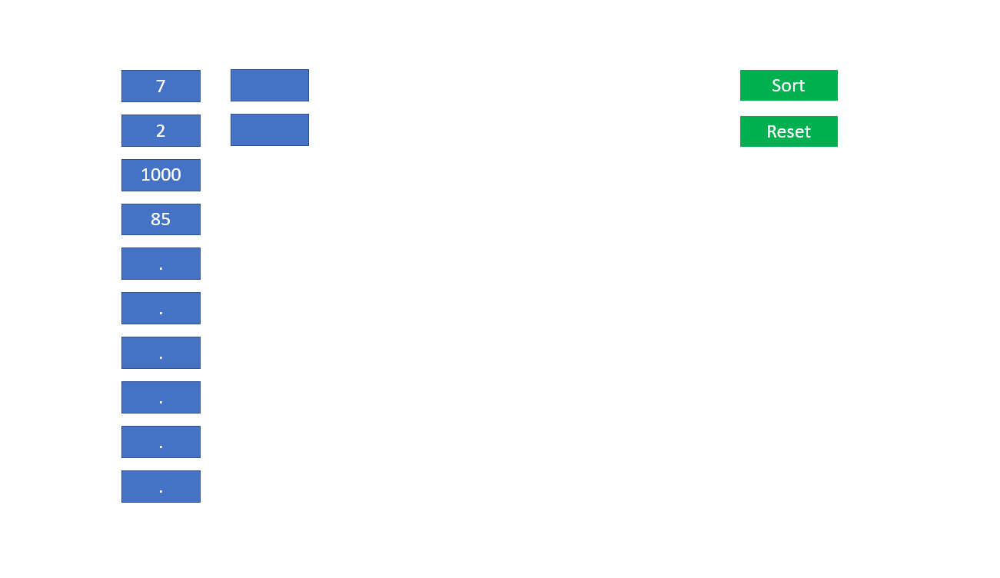

# Technical task

Create a single page application. The app has 2 main screens, Intro & Sort.

Clicking “enter” button takes to next screen, Sort.

Numbers buttons:
1.	Show X random numbers (depends on data entered by user in the previous screen)
2.	The max number value is 1000
3.	At least one value should be equal or less than 30
4.	Present maximum 10 numbers in a column. If there are more numbers, add another column

Sort button:
5.	Clicking the sort button will sort the presented numbers in a descending order
6.	Clicking the sort button again, will change it to increasing order
7.	The screen should be updated after each iteration of quick-sort (i.e. re-implement quick-sort; copy/paste of existing implementation is permitted).

Reset button:
Takes back to intro screen.

Clicking one of the numbers button:
8.	If the clicked value is equal or less than 30, present X new random numbers on the screen
9.	If the clicked value is more than 30, pop up a message “Please select a value smaller or equal to 30.”
